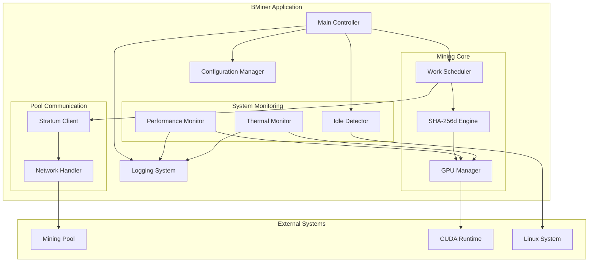
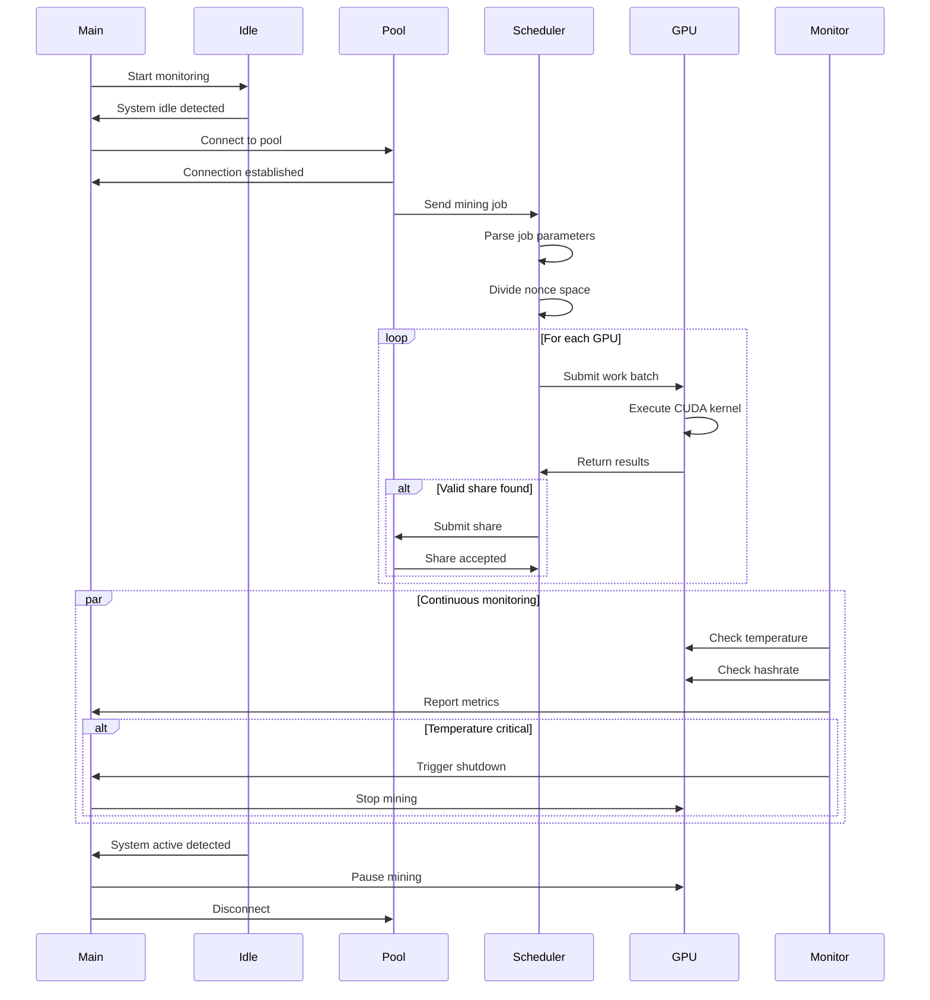

# BMiner - Bitcoin GPU Miner Technical Specification

## Project Overview

**BMiner** is a production-ready Bitcoin miner written in Rust, designed to utilize NVIDIA GPU resources during system idle periods. The miner focuses on Linux systems with CUDA support and includes comprehensive features for pool mining, monitoring, and resource management.

## Core Requirements

### Functional Requirements
- **GPU Mining**: Efficient Bitcoin SHA-256d mining using NVIDIA CUDA
- **Pool Support**: Stratum protocol (V1/V2) for mining pool connectivity
- **Idle Detection**: Intelligent system monitoring to mine only during idle periods
- **GPU Management**: Multi-GPU support with selection and configuration
- **Performance Monitoring**: Real-time hashrate, temperature, and power metrics
- **Configuration**: Flexible TOML-based configuration system
- **Logging**: Structured logging with multiple severity levels and outputs

### Non-Functional Requirements
- **Performance**: Maximize GPU utilization while maintaining system responsiveness
- **Reliability**: Automatic error recovery and pool failover
- **Security**: Secure credential storage and encrypted pool connections
- **Maintainability**: Clean architecture with comprehensive documentation
- **Scalability**: Support for multiple GPUs and mining pools

## System Architecture



## Component Specifications

### 1. Project Structure

```
bminer/
├── Cargo.toml                 # Workspace manifest
├── README.md                  # User documentation
├── TECHNICAL_SPEC.md          # This file
├── LICENSE                    # License file
├── .gitignore                 # Git ignore rules
│
├── crates/
│   ├── bminer-core/           # Core mining logic
│   │   ├── Cargo.toml
│   │   └── src/
│   │       ├── lib.rs
│   │       ├── hasher.rs      # SHA-256d implementation
│   │       ├── work.rs        # Work unit management
│   │       └── nonce.rs       # Nonce space handling
│   │
│   ├── bminer-cuda/           # CUDA integration
│   │   ├── Cargo.toml
│   │   ├── build.rs           # CUDA compilation
│   │   └── src/
│   │       ├── lib.rs
│   │       ├── device.rs      # GPU detection/management
│   │       ├── kernel.rs      # Kernel wrapper
│   │       └── kernels/
│   │           └── sha256.cu  # CUDA kernel
│   │
│   ├── bminer-pool/           # Pool protocol
│   │   ├── Cargo.toml
│   │   └── src/
│   │       ├── lib.rs
│   │       ├── stratum.rs     # Stratum protocol
│   │       ├── client.rs      # Pool client
│   │       └── message.rs     # Message types
│   │
│   ├── bminer-monitor/        # System monitoring
│   │   ├── Cargo.toml
│   │   └── src/
│   │       ├── lib.rs
│   │       ├── idle.rs        # Idle detection
│   │       ├── performance.rs # Performance metrics
│   │       └── thermal.rs     # Temperature monitoring
│   │
│   └── bminer-cli/            # CLI application
│       ├── Cargo.toml
│       └── src/
│           ├── main.rs
│           ├── config.rs      # Configuration
│           ├── logger.rs      # Logging setup
│           └── scheduler.rs   # Work scheduler
│
├── config/
│   └── bminer.toml.example    # Example configuration
│
├── docs/
│   ├── user-guide.md          # User guide
│   ├── api.md                 # API documentation
│   └── deployment.md          # Deployment guide
│
└── tests/
    ├── integration/           # Integration tests
    └── benchmarks/            # Performance benchmarks
```

### 2. Core Dependencies

```toml
[workspace.dependencies]
# Async runtime
tokio = { version = "1.40", features = ["full"] }
async-trait = "0.1"

# CUDA bindings
cuda-sys = "0.3"
cudarc = "0.11"

# Cryptography
sha2 = "0.10"
hex = "0.4"

# Networking
tokio-tungstenite = "0.23"
serde_json = "1.0"

# Configuration
serde = { version = "1.0", features = ["derive"] }
toml = "0.8"
config = "0.14"

# Logging
tracing = "0.1"
tracing-subscriber = "0.3"
tracing-appender = "0.2"

# Error handling
thiserror = "1.0"
anyhow = "1.0"

# System monitoring
sysinfo = "0.31"
nvml-wrapper = "0.10"

# CLI
clap = { version = "4.5", features = ["derive"] }

# Testing
criterion = "0.5"
mockall = "0.13"
```

### 3. Configuration Schema

```toml
[pool]
# Primary pool configuration
url = "stratum+tcp://pool.example.com:3333"
username = "your_wallet_address"
password = "x"
worker_name = "bminer-01"

# Backup pools for failover
[[pool.backup]]
url = "stratum+tcp://backup.example.com:3333"
username = "your_wallet_address"
password = "x"

[gpu]
# GPU selection (empty = all GPUs)
devices = []  # e.g., [0, 1] for first two GPUs
# Power limit in watts (0 = no limit)
power_limit = 0
# Target temperature in Celsius
target_temp = 75
# Fan speed percentage (0 = auto)
fan_speed = 0

[mining]
# Mining intensity (1-10, higher = more aggressive)
intensity = 8
# Work batch size
batch_size = 1024
# Share submission timeout in seconds
submit_timeout = 30

[idle]
# Enable idle detection
enabled = true
# CPU usage threshold percentage
cpu_threshold = 20
# GPU usage threshold percentage
gpu_threshold = 10
# Idle time required before mining starts (seconds)
idle_time = 300
# Check interval in seconds
check_interval = 10

[monitoring]
# Enable performance monitoring
enabled = true
# Statistics update interval in seconds
update_interval = 30
# Enable thermal monitoring
thermal_monitoring = true
# Temperature warning threshold
temp_warning = 80
# Temperature critical threshold (stops mining)
temp_critical = 85

[logging]
# Log level: trace, debug, info, warn, error
level = "info"
# Log to file
file_enabled = true
file_path = "/var/log/bminer/bminer.log"
# Log rotation size in MB
rotation_size = 100
# Number of rotated files to keep
rotation_count = 5
# Log to console
console_enabled = true
```

### 4. Mining Algorithm Flow



### 5. CUDA Kernel Design

The SHA-256d kernel will implement:

**Kernel Parameters:**
- Block header (80 bytes)
- Starting nonce
- Nonce range per thread
- Target difficulty
- Result buffer

**Optimization Strategies:**
- Shared memory for constants
- Warp-level primitives for reduction
- Coalesced memory access
- Register optimization
- Occupancy tuning

**Expected Performance:**
- Target: 100+ MH/s per RTX 3080
- Memory bandwidth: Minimize global memory access
- Kernel launch overhead: Batch work submissions

### 6. Stratum Protocol Implementation

**Supported Methods:**
- `mining.subscribe` - Subscribe to pool
- `mining.authorize` - Authenticate worker
- `mining.notify` - Receive new work
- `mining.submit` - Submit share
- `mining.set_difficulty` - Difficulty adjustment
- `mining.set_extranonce` - Extranonce update

**Message Format:**
```json
{
  "id": 1,
  "method": "mining.submit",
  "params": [
    "username",
    "job_id",
    "extranonce2",
    "ntime",
    "nonce"
  ]
}
```

### 7. Idle Detection Strategy

**Multi-factor Detection:**
1. **CPU Usage**: Monitor system-wide CPU utilization
2. **GPU Usage**: Check GPU compute utilization via NVML
3. **User Activity**: Track keyboard/mouse input events
4. **Process Activity**: Monitor active window and processes
5. **Time-based**: Configurable idle timeout period

**State Machine:**
```
ACTIVE → (idle conditions met) → IDLE_PENDING → (timeout) → IDLE_MINING
IDLE_MINING → (activity detected) → ACTIVE
```

### 8. Performance Monitoring

**Metrics Collected:**
- Hashrate (current, average, peak)
- Shares (accepted, rejected, stale)
- GPU metrics (temperature, power, utilization)
- Pool metrics (latency, uptime)
- System metrics (CPU, memory)

**Output Formats:**
- Console display (real-time)
- Log files (historical)
- JSON API (optional web interface)

### 9. Error Handling

**Error Categories:**
1. **GPU Errors**: Device lost, out of memory, kernel failure
2. **Network Errors**: Connection lost, timeout, invalid response
3. **Configuration Errors**: Invalid config, missing parameters
4. **System Errors**: Insufficient permissions, resource exhaustion

**Recovery Strategies:**
- Automatic reconnection with exponential backoff
- GPU reset and reinitialization
- Graceful degradation (continue with available GPUs)
- Detailed error logging for debugging

### 10. Security Considerations

**Implemented Measures:**
- Secure credential storage (avoid plaintext passwords in logs)
- TLS support for pool connections
- Input validation for all external data
- Resource limits to prevent DoS
- Privilege separation (run as non-root when possible)

## Implementation Phases

### Phase 1: Foundation (Tasks 1-4)
- Set up project structure
- Implement core architecture
- Basic CUDA integration
- SHA-256d algorithm implementation

### Phase 2: Mining Core (Tasks 5-7)
- CUDA kernel optimization
- Stratum protocol implementation
- Idle detection system

### Phase 3: Management (Tasks 8-11)
- Configuration system
- Performance monitoring
- Logging infrastructure
- GPU management

### Phase 4: Reliability (Tasks 12-13)
- Work scheduler
- Error handling and recovery

### Phase 5: Quality (Tasks 14-16)
- Testing suite
- Documentation
- Build and deployment

## Performance Targets

### Hashrate Goals
- RTX 3080: 100+ MH/s
- RTX 3090: 120+ MH/s
- RTX 4090: 150+ MH/s

### Resource Usage
- CPU overhead: < 5%
- Memory usage: < 500 MB
- GPU memory: < 1 GB per device

### Reliability
- Uptime: 99.9%
- Pool reconnection: < 5 seconds
- Error recovery: Automatic

## Testing Strategy

### Unit Tests
- Individual component functionality
- Edge cases and error conditions
- Mock external dependencies

### Integration Tests
- End-to-end mining workflow
- Pool communication
- GPU interaction

### Performance Tests
- Hashrate benchmarks
- Memory usage profiling
- Kernel optimization validation

### System Tests
- Multi-GPU scenarios
- Long-running stability
- Failover mechanisms

## Deployment

### System Requirements
- Linux kernel 5.4+
- NVIDIA driver 525.60.13+
- CUDA 12.0+
- 4GB+ RAM
- Network connectivity

### Installation
```bash
# Install from binary
curl -sSL https://bminer.io/install.sh | bash

# Or build from source
git clone https://github.com/yourusername/bminer.git
cd bminer
cargo build --release
```

### Configuration
```bash
# Copy example config
cp config/bminer.toml.example ~/.config/bminer/bminer.toml

# Edit configuration
nano ~/.config/bminer/bminer.toml

# Run miner
bminer --config ~/.config/bminer/bminer.toml
```

## Future Enhancements

### Potential Features
- Web dashboard for monitoring
- Multiple algorithm support (Ethereum, etc.)
- Profit switching between coins
- Overclocking profiles
- Remote management API
- Windows and macOS support
- AMD GPU support (OpenCL)

## References

- Bitcoin Protocol: https://en.bitcoin.it/wiki/Protocol_documentation
- Stratum Protocol: https://braiins.com/stratum-v1/docs
- CUDA Programming Guide: https://docs.nvidia.com/cuda/
- NVML API: https://developer.nvidia.com/nvidia-management-library-nvml